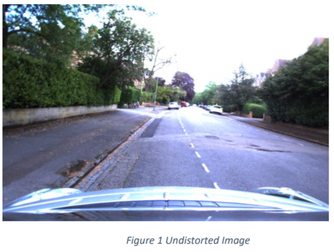
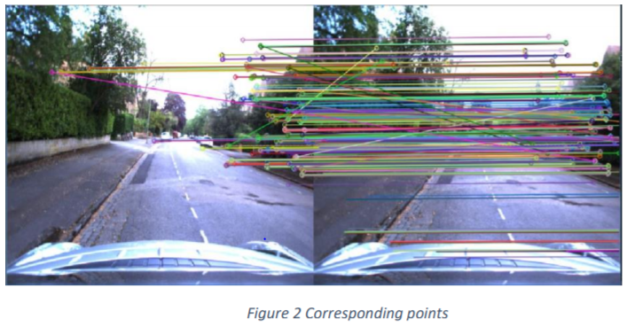
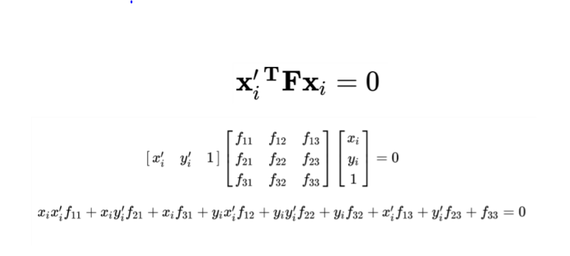
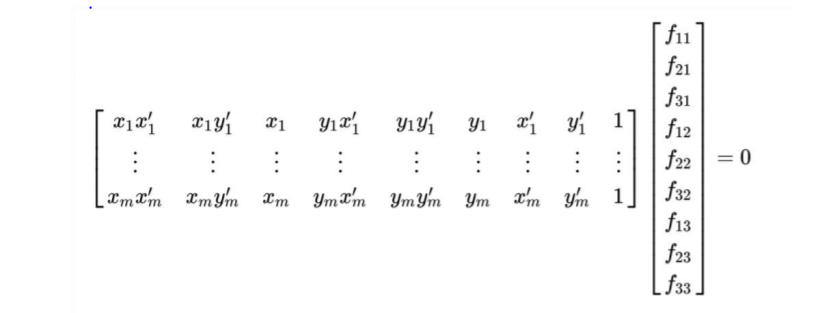
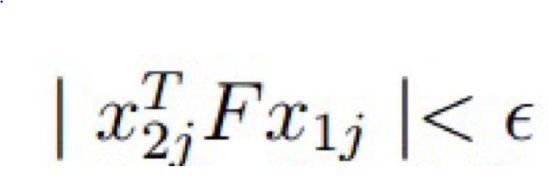
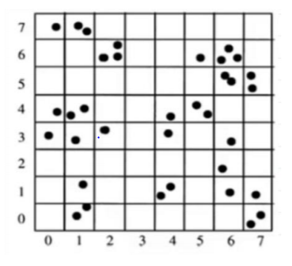
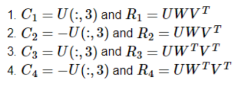

<h1 align=center> Visual odometery </h1>
<p align="center">

[](https://opensource.org/licenses/BSD-3-Clause)

## Overview
Visual Odometry is a crucial concept in Robotics Perception for estimating the trajectory of the robot (the camera on the robot to be precise). The concepts involved in Visual Odometry are quite the same for SLAM
which needless to say is an integral part of Perception.

In this project we take the driving sequence frames taken by a camera in a car then we estimate the 3D motion of the
camera using the pipeline developed, and provide as output a plot of the trajectory of the camera. The dataset can be found in this [folder](https://drive.google.com/drive/folders/1f2xHP_l8croofUL_G5RZKmJo2YE9spx9).

## License
This project is under the [BSD License](https://github.com/krawal19/visual_odometery/blob/master/LICENSE).

## Dependencies
The ARTag detection and Tracking package requires following dependencies.
- Numpy
- random
- glob
- math
- matplotlib
- Python 3.5.4
- OpenCV 4.0.0

## Operation
#### The pipeline for Visual Odometery is as follows:
#### A) Data Preparation
1. Theinput images given to me was in the Bayer Format which we converted to the color images usingfollowing command.
```
color_image = cv2.cvtColor(img,cv2.COLOR_BayerGR2BGR)
```
2. We then extracted the 
camera calibration matrix K using the following command.
```
fx, fy, cx, cy, Gcameraimage, LUT=ReadCameraModel(‘./model’)
```
3. The images are undistorted using the following function in the extraction.py file.
```
Undistorted_image = UndistortImage(original_image,LUT)
```
<p align="center">

</p>


#### B) Finding Correspondences
1. We are using the Oriented FAST and Rotated BRIEF(ORB)forfinding features in the imageand using BFMatcherfor matching those features betweentwo images.The following command in the code does that.
```
orb = cv2.ORB_create()
kp1, des1 = orb.detectAndCompute(img1,None)
kp2, des2 = orb.detectAndCompute(img2,None)
bf = cv2.BFMatcher(cv2.NORM_HAMMING, crossCheck=True)
matches = bf.match(des1, des2)
```
2. We then extract the points from the matches and store them in separate arrays. They are the forwarded to find the Fundamental Matrix.

<p align="center">

</p>

#### Fundamental Matrix
1. For  determining  the  correspondence  of  the  key-points  between  two consecutive  frames,  we  define  the fundamental matrix(F). Fundamental matrix is a transformation matrix that transforms the key-point in the first image frame to the epipolar line in the next frame. The point of correspondence lies on that epipolar line.
2. Fundamental matrix can be determined for two consecutive frames if the corresponding key-points are given. This can be determined by any feature detector algorithm (eg. SIFT, FAST, ORB, etc). For this project we will use ORB  feature  detector.  Feature  detectors  are  rotation  and  scaling  invariant.  They  provide  the  functionality  of feature descriptor and feature matching.
3. Now we have the matching key-points. Thus, we use 8-point algorithm

#### A) 8-Point Algorithm
1. We know that a correct Fundamental Matrix will verify the correct correspondence of the feature points. Thus, the following equation will be satisfied. Where F is fundamental matrix, x is the feature point array in image1 and x’ is a point array in image 2.
<p align="center">

</p>
2. So, we select 8 random feature points to form the arrays x and x’. We require a minimum of 8 points because the F matrix is 3x3 matrix with 9 parameters. Thus,to obtain a unique solution, we require a minimum of 8 points.
<p align="center">

</p> 
3. To solve for F matrix parameters,we find the SVD and select the last column of the V matrix. Thus, we obtain the F matrix parameter.
4. The we know that the system should have a rank = 2. This is because the F matrix only determines the translation motion of the key-points. Thus, we enforce the F matrix to be of rank 2 by making the last element F[2,2] = 0.

#### PROBLEMS:
1. As, the algorithm selects 8 points at random, there is a very high chance that the selected points are outliers. Thus, theresultant F matrix obtained is erroneous. 
2. To improve the result, we apply RANSAC to reject the outliers.

#### B) RANSAC(Random Sampling and Consensus)
1. RANSACis a common method of outlier rejection. The idea behind this to iteratively apply the 8-point algorithm by selecting the random points and calculating the number of inliers using the generated Fundamental matrix.
2. Thus,by repeating this process for a specific number of times, we select the Fundamental Matrix that produces the highest number of inliers.•This method will improve the F Matrix generation as it makes sure the resultant F matrix has high number of inliers.
3. The inliers are determined by the following equation where the inliers will have the value very close to zero and this will be compared by a threshold value.
<p align="center">

</p>

#### PROBLEMS:
1. This, method looks as it will generate the accurate result for the fundamental matrix. But, the problem with this method is that it selects the 8 points randomly for the 8-point algorithm.
2. This may lead to repetition of points or selecting the points from the same feature area. Hence, the result of the fundamental matrix is not accurate enough.
3. To improve on this problem, we use method of Robust Fundamental Matrix Estimation by Zhang.

##### C) ROBUST FUNDAMENTAL MATRIX ESTIMATION (BY ZHANG)
1. In the following method we divide the image in 8x8 grids as shown below.
<p align="center">

</p>

2. Then, we select randomly a grid and the select a point from the grid randomly. Also, we make sure that no grids are repeated if other options are available.
3. Then after selecting the 8-points we use the 8 point algorithm with RANSAC. (RANSAC will select random points in the random grid manner as mentioned above).
4. This method improves the resultant F matrix as it avoids the repeated point selection.
5. This method is implemented through the command below.

```
fmatrix, inliersPoints1, inliersPoints2 = findRANSAC(point1.T, point2.T, w, h)
```

#### D) Essential Matrix
1. This essential matrix E is calculated by multiplying the calibration matrix calculated instep 1 as follows.
<p align="center">
𝐄=𝐊𝐓𝐅𝐊
</p>

2. The essential matrix is implemented through the following command
```
E1 = findEssentialMatrix(fmatrix, calibrationMatrix, calibrationMatrix.T)5)
```
#### E) Calculating the Camera Poses
1. The camera poses is calculated from the essential matrix using the following formula.
<p align="center">

</p>
2. When the determinant of the rotation matrix is less then zero the we make the following correction to the matrices.
<p align="center">
C=−C and R=−R
</p>
3. The camera poses are obtained by implementing the following command.

```
C1, R1, C2, R2, C3, R3, C4, R4 = getCameraPose(E1)
```

#### F) Triangulation Check for Cheirality Condition
1. The linear triangulation is done by first calculatingthe projection matrices for the two camera imagesusing all the four sets of camera poses.
2. Then  we  take  the  correspondence pointsand calculatethe  skew  matrices  and multiply  with  them  with  the corresponding projection matricesto calculate matricesA1 and A2whichwe then stack up andthen decompose it to find its eigen vectors.
3. The X is the last column of V whichwe divide by the 4thelement to convert it into homogeneousformand store it. 
4. Cheirality check is done for all corresponding inliers and the R and C matrix that gives the maximum positivesfor the following equation is chosen.
<p align="center">
r3(X−C)>0
</p>

5. The triangulation is programmed in the function named linear Triangulate

#### G) Heuristic Check
1. Due to the noise in the image the final camera poses which we get is noisy and hence need to be treated by performing some heuristic checks.
2. We have conducted 5 heuristic checks which will be discussed in this section.
3. The first check is that the Z coordinate of the pose should be positive considering that car is always moving
forward.
4. The second check is for checking the elements of the rotational matrices.
5. The third check corrects the noisy readings in the y direction
6. The fourth and fifth check is regarding restricting the rotation to only about Y-axis.

#### H) Calculating the pose from origin
1. To find the translation from the origin we multiply the transpose of the rotation matrix obtained from disambiguating and multiply it with the translation matrix. Then we multiply the negative of the rotation matrix
from origin to the output of the previous multiplication and add it to the previous translation matrix to get the final distance travelled by the camera.
2. The Rotation matrix is basically the previous rotation matrix multiplies by new rotation matrix obtained after
disambiguating.
3. The custom function performs the same things, but it is distributed in across various functions.
4. Here the trajectory is found without knowing the scale. It is only possible to know the scale if the output is
integrated with other inertial devices like the odometer.


## Instructions
Download the dependencies and follow the below commands to run the code.
- Open the extraction.py code in an editor or terminal
- Type “python extraction.py” in terminal or press run in an editor
- The code will post all the undistorted images in the undistorted folder
- Then open the visualOdometry.py code in an editor or terminal
- Type “python visualOdometry.py” in terminal or press run in an editor
- This code will post all the outputs in the output folder
We have also provided a video of our codes output for you reference

The output will be printed in the folder of the code. We have also provided sample outputs.

## Note
The above pipeline is developed specifically of the given videos under data folder and is not generalized.
We have provided following folders and files
- output: Here the output plots will be stored
- undistorted: Contains the undistorted images
- extraction.py: Contains code for reading and undistorting the images
- ReadCameraModel.py: Contains code for getting camera parameters
- UndistortImage.py: Contains function that undistorts image
- visualOdometry.py: This file runs the visual odometry code using the undistorted images.
